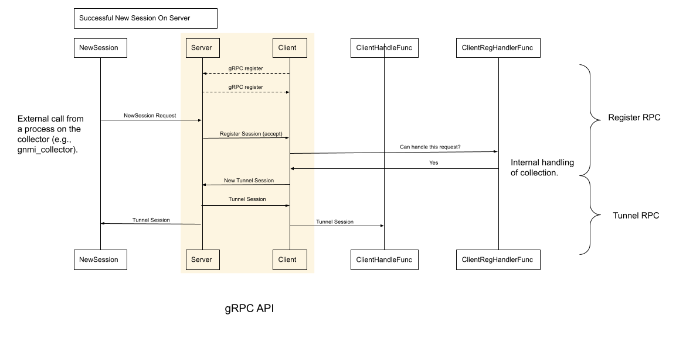

# TCP over gRPC Tunnel

**Contributors**:
James Protzman, Carl Lebsack, Rob Shakir

**February, 2019**
*Updated*: February 2021

<!-- MarkdownTOC -->

- [TCP over gRPC Tunnel](#tcp-over-grpc-tunnel)
  - [Objective](#objective)
  - [Background](#background)
  - [Overview](#overview)
  - [Detailed Design](#detailed-design)
    - [Tunnel Proto Design](#tunnel-proto-design)
    - [Data Message Fields](#data-message-fields)
      - [Tag Field](#tag-field)
      - [Data Field](#data-field)
      - [Close Field](#close-field)
    - [RegisterOp Message Fields](#registerop-message-fields)
    - [Session Message Fields](#session-message-fields)
      - [Tag Field](#tag-field-1)
      - [Accept Field](#accept-field)
      - [Target ID Field](#target-id-field)
      - [Target Type Field](#target-type-field)
      - [Error Field](#error-field)
    - [Target Message Fields](#target-message-fields)
      - [Op Field](#op-field)
      - [Accept / Target ID/ Target Type / Error Fields](#accept--target-id-target-type--error-fields)
    - [Subscription Message Fields](#subscription-message-fields)
      - [Op Field](#op-field-1)
      - [Accept Fields](#accept-fields)
      - [Target Type Fields](#target-type-fields)
      - [Error Fields](#error-fields)
    - [Handlers](#handlers)
    - [Client](#client)
    - [Server](#server)
    - [Target Registration](#target-registration)
    - [Subscription](#subscription)
    - [Bridge Mode](#bridge-mode)

<!-- /MarkdownTOC -->


## Objective

To create a transparent, bi-directional TCP-over-gRPC tunnel.


## Background

gRPC is a service based strictly around a client-server model in order to send a
gRPC request. gRPC Requests are executed on the server, and the result(s) are
returned to the client. If the client is unable to reach the server for any
reason, then it is not possible to send the request.

Common reasons that a gRPC client would be unable to communicate with a server
include:

*   the server is behind a firewall with ACLs preventing inbound connections
*   the server is behind a router implementing address translation (NAT)
*   other operational requirements which prevent outside connections

See the figure below for an example:


Additional references and discussion:

[gRPC tunneling (Github issue)](https://github.com/grpc/grpc/issues/14101)
[gRPC-in-gRPC tunneling](https://github.com/jhump/grpctunnel)

## Overview

In the cases outlined above, it could be preferable to instantiate a connection
in reverse (server to client) between the gRPC client and server rather than
modifying the infrastructure between them. However, there is no mechanism built
into the gRPC library which supports reverse connections.

This document proposes an approach which will allow a gRPC client and server to
communicate using a TCP over gRPC tunnel. The tunnel will support external
connections from either endpoint over TCP and forward them using gRPC streams.
It’s possible that this tunnel could be used to forward more than gRPC traffic.

An overview of how the tunnel works from both client and server sides follows:

**Server side**:

1.  A new session, identified by a unique string, is requested from the tunnel
    server.
1.  The tunnel server forwards a request through the register stream.
1.  If the tunnel client can handle this request, it will do 2 things:
    1.  create a new tunnel stream to the server, and
    1.  call the client defined handler on the stream.
1.  The tunnel server will accept and return the stream.

More detail can be found in the [server section](#server) below.

**Client side**:

1.  A new session, identified by a unique string, is requested from the tunnel
    client.
1.  The tunnel client forwards a request through the register stream.
1.  The tunnel server will send an accepted request back to the client on the
    register stream.
1.  The tunnel client will
    1.  create a new tunnel stream to the server, and
    1.  return the stream.
1.  The tunnel server will accept the stream, and call the client defined
    handler.

More detail can be found in the [client section](#client) below.

The figure below illustrates the communication:


## Detailed Design

### Tunnel Proto Design

```
service Tunnel {
  rpc Register(stream RegisterOp) returns (stream RegisterOp);
  rpc Tunnel(stream Data) returns (stream Data);
}

message Data {
  int32 tag = 1;
  bytes data = 2;
  bool close = 3;
}

message RegisterOp {
  oneof Registration {
    Target target = 1;
    Session session = 2;
    Subscription subscription = 3;
  }
}

enum TargetType {
  UNKNOWN = 0;
  SSH = 22;
  GNMI_GNOI = 9339;
}

message Target {
  enum TargetOp {
    UNKNOWN = 0;
    ADD = 1;
    REMOVE = 2;
  }
  TargetOp op = 1;
  bool accept = 2;
  string target_id = 3;
  string target_type = 4;
  string error = 5;
}

message Session {
  int32 tag = 1;
  bool accept = 2;
  string target_id = 3;
  string target_type = 4;
  string error = 5;
}


message Subscription {
  enum SubscriptionOp {
    UNKNOWN = 0;
    SUBCRIBE = 1;
    UNSUBCRIBE = 2;
  }
  SubscriptionOp op = 1;
  bool accept = 2;
  string target_type = 3;
  string error = 4;
}

```


**Tunnel protobuf definition**

The tunnel proto defines a gRPC service, `Tunnel`, which defines two rpc
methods:

1. a `register` method which allows the tunnel server to request new tunnel
streams from the client using [RegisterOp messages](#registerop-message-fields), and
2. a `tunnel` method, which is used to create new tunnel streams. These streams
forward the data from TCP streams over a bi-directional gRPC stream of [data
messages](#data-message-fields).

Each field is described in the next section.

### Data Message Fields

#### Tag Field

The tunnel `tag` field is used by the tunnel endpoints to ensure the correct
tunnel streams are used to forward the correct TCP client connections.

#### Data Field

The `data` field is used to encapsulate raw bytes received from the client code.
This data will be forwarded, unchanged through the tunnel endpoints, to the
proper destination. This allows the tunnel to potentially handle non-gRPC
connections.

#### Close Field

The `close` field is used by the tunnel endpoints to know when forwarding has
finished - usually signalled by the TCP connection reaching EOF or going idle.
Once this boolean is set, the client and server will clean up the associated
tunnel connections.

### RegisterOp Message Fields

RegisterOp can be one of Target, Session or Subscription message.

### Session Message Fields

#### Tag Field

The `tag` field in the register service is used by the tunnel endpoints to
request new tunnel streams for a certain tag.  This tag defines the set of tags
used by the [data message tag field](#tag-field). By default, the tunnel server
uses positive tags, and the tunnel client uses negative tags. They start at 1,
and -1, respectively to disambiguate 0.

#### Accept Field

The `accept` field is sent by the tunnel server to indicate that it added an
associated connection in its map. This allows a new tunnel session from the
client to be handled correctly.

#### Target ID Field

The `target_id` field is used by the register handler on either the tunnel
server or client to define what the handler function can handle. This is
explained in more detail in the [handlers](#handler-field) sections below.

#### Target Type Field

The `target_type` represents the type of targets. It is use together with 
target_id in most cases.

#### Error Field

The `error` field is used by the client and server to exchange errors
encountered when requesting new sessions.

### Target Message Fields

#### Op Field

The `op` field is used to represent different registration operations 
(ADD/REMOVE/UNKNOWN).

#### Accept / Target ID/ Target Type / Error Fields

These fields carry the same meaning as the corresponding fields in the Session 
message.

### Subscription Message Fields

#### Op Field

The `op` field is used to represent different subscription operations
(subscribe/unsubscribe/unknown).

#### Accept Fields

The `accept` field is sent by the tunnel server to indicate that the 
subscription is successful.

#### Target Type Fields

The `type_type` field is used to indicate the eligible targets. If it is empty, 
the server will assume that the client wants to subscribe everything.

#### Error Fields

The `error` field is used by the server to send back errors if the subscription 
is unsuccessful.


### Handlers

There are two handlers used by the tunnel: the register handler function, and
the handler function itself. The register handler function defines what the
handler function will accept. A handler function and register handler are
required on one end of the tunnel in order to forward traffic, as they handle
what is done with a stream on the opposing side of a new session request.

### Client

A new client will be created and started using the `NewClient`. When the client
is started, it will attempt to connect to the tunnel server over the register
client will wait until they receive a request for a new session. The server
gRPC service. If it is successful, the client [registers](#target-registration) its target 
id and target type. If configured, the client will also 
[subscribe](#subscription) targets from the server. At this point, the server 
and section](#server) below will cover new session requests from the server 
perspective.

When `NewSession` is called on the client, it will send a register request to
the server. The server will check if it can handle the register request via the
server register handler. This handler will return an error if it cannot handle
the requested session. If it can handle it, the server will send a register
session ack back to the client and the client will start a new tunnel stream,
using the tunnel gRPC service. At this time, all register requests sent to the
client should contain the accept message. The rationale is that the client will
only receive requests from the server which are ready to have a new tunnel
session created for them.

This stream is passed to the server handler function on the server, and returned
to `NewSession` on the client side. See the timing diagram below.



### Server

A server will need to be created using `grpc.NewServer` and the exported
`NewServer` method from this tunnel package.  Once the server is listening, it
will accept a connection from a client and exchange capabilities. The new server
will then wait for new session requests.

When `NewSession` is called on the server, it will send a register request, with
an ack to the tunnel client. The client will then check if it can handle the
request, and if it can, it will create a new tunnel session to the server. The
tunnel session is then forwarded to the client handler function on the client,
and returned to the `NewSession` request on the server.

### Target Registration

During registration, a client will send a `Target` message to register its
target (ID and type). The server will check if the target is already registered.
It will return an error message not accepted (e.g. target already exists) or 
return an accepted acknowledgement message otherwise. A target addition handler 
will be called.

Once the tunnel is up running, subsequent addition and deletion of targets are 
also supported.

### Subscription

During registration, a client sends an `subscription` message to subscribe
targets from the server. The subscription can be either by target type 
or everything if the `target_type` field is empty. Once the server receives the
subscription, it will send a list of filtered targets back to client as
`Target` message. After sending the whole list, it sends a accepted message.
The server will also send updates to all corresponding subscribers when a 
target is added or deleted.

Once the tunnel is up running, subsequent subscription and unsubscription are 
also supported.

### Bridge Mode

The bridge mode is a special session initiated from a client, where the
requested target is `remote` to server. It is initiated in the same way as
non-bridge session via `NewSession` while the target ID and type corresponds to
a `remote` target for the server.

Upon receiving such request, server will check if the request corresponds to a
`remote` target (otherwise, it will be treated as a normal new session request
as in [Client](#client)). Next, the bridge reigster handler and tunnel handler
will be called, where it will call `NewSession` to create  a new session to the 
`remote` client, and start a continuous bi-direcitonal copy between the newly
created session (with the `remote` client) and the session with the original 
client.
